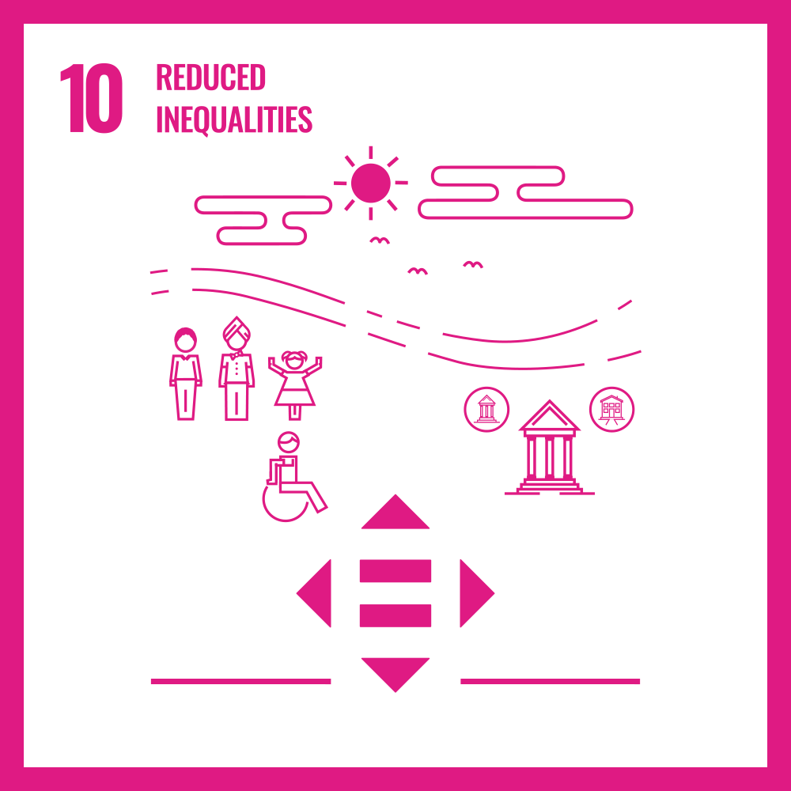

# UN Sustainable Development Goals

#### Goal 1 - No Poverty 
To end poverty in all its forms everywhere by 2030.
  

  
  

#### Goal 2 - Zero Hunger
To end hunger, achieve food security and improved nutrition and promote sustainable agriculture.

  
  

#### Goal 3 - Good Health and Well-Being
To ensure healthy lives and promote well-being for all at all ages.

  
  

#### Goal 4 - Quality Education
Ensure inclusive and quality education for all and promote lifelong learning.

  
  

#### Goal 5 - Gender Equality
To achieve gender equality and empower all women and girls.

  
  

#### Goal 6 - Clean Water and Sanitation
To ensure access to safe water sources and sanitation for all.

  
  

#### Goal 7 - Affordable and Clean Energy
To ensure access to affordable, reliable, sustainable and modern energy for all.

  
  

#### Goal 8 - Decent Work and Economic Growth
To promote inclusive and sustainable economic growth, employment and decent work for all.

  
  

#### Goal 9 - Industry, Innovation and Infrastructure
To build resilient infrastructure, promote inclusive and sustainable industrialization and foster innovation.

  
  

#### Goal 10 - Reduced Inequalities
To reduce inequalities within and among countries.

  
  

#### Goal 11 - Sustainable Cities and Communities 
To make cities inclusive, safe, resilient and sustainable.

  
  

#### Goal 12 - Responsible Consumption and Production
To ensure sustainable consumption and production patterns.

  
  

#### Goal 13 - Climate Action
Taking urgent action to tackle climate change and its impacts.

  
  

#### Goal 14 - Life Below Water
To conserve and sustainably use the world’s ocean, seas and marine resources.

  
  

#### Goal 15 - Life on Land
To sustainably manage forests, combat desertification, halt and reverse land degradation, and halt biodiversity loss.

  
  

#### Goal 16 - Peace, Justice and Strong Institutions
Promote peaceful and inclusive societies for sustainable development, provide access to justice for all and build effective, accountable and inclusive institutions at all levels.

  
  

#### Goal 17 - Partnerships for the Goals
To revitalize the global partnership for sustainable development.

  
  

