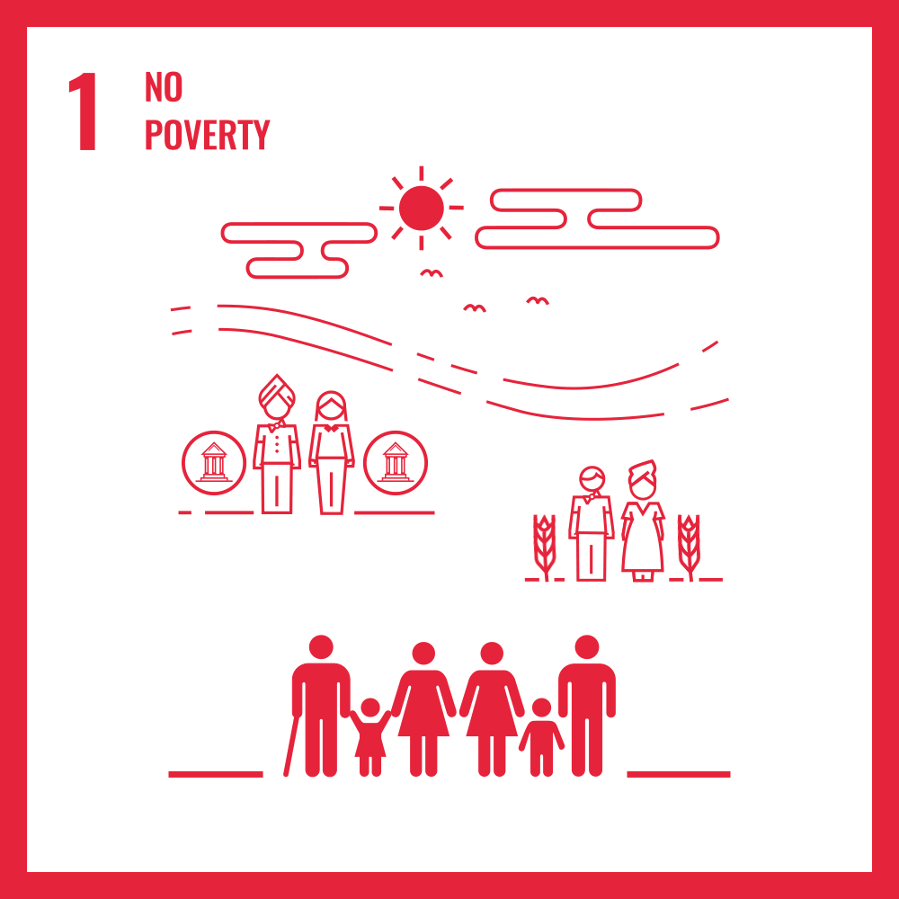
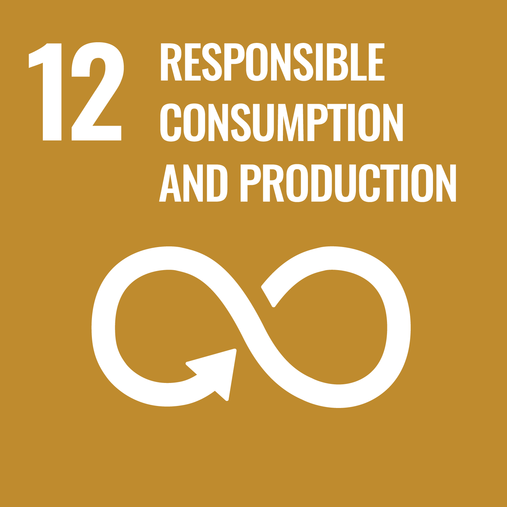

# UN Sustainable Development Goals

#### Goal 1 - No Poverty 

  
  

#### Goal 2 - Zero Hunger

  
  

#### Goal 3 - Good Health and Well-Being

  
  

#### Goal 4 - Quality Education

  
  

#### Goal 5 - Gender Equality

  
  

#### Goal 6 - Clean Water and Sanitation

  
  

#### Goal 7 - Affordable and Clean Energy

  
  

#### Goal 8 - Decent Work and Economic Growth

  
  

#### Goal 9 - Industry, Innovation and Infrastructure

  
  

#### Goal 10 - Reduced Inequalities

  
  

#### Goal 11 - Sustainable Cities and Communities 

  
  

#### Goal 12 - Responsible Consumption and Production

  
  

#### Goal 13 - Climate Action

  
  

#### Goal 14 - Life Below Water

  
  

#### Goal 15 - Life on Land

  
  

#### Goal 16 - Peace, Justice and Strong Institutions

  
  

#### Goal 17 - Partnerships for the Goals

  
  

